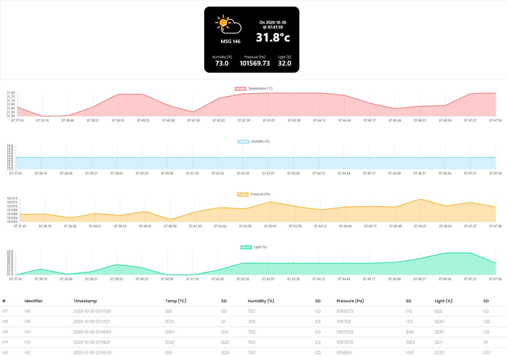
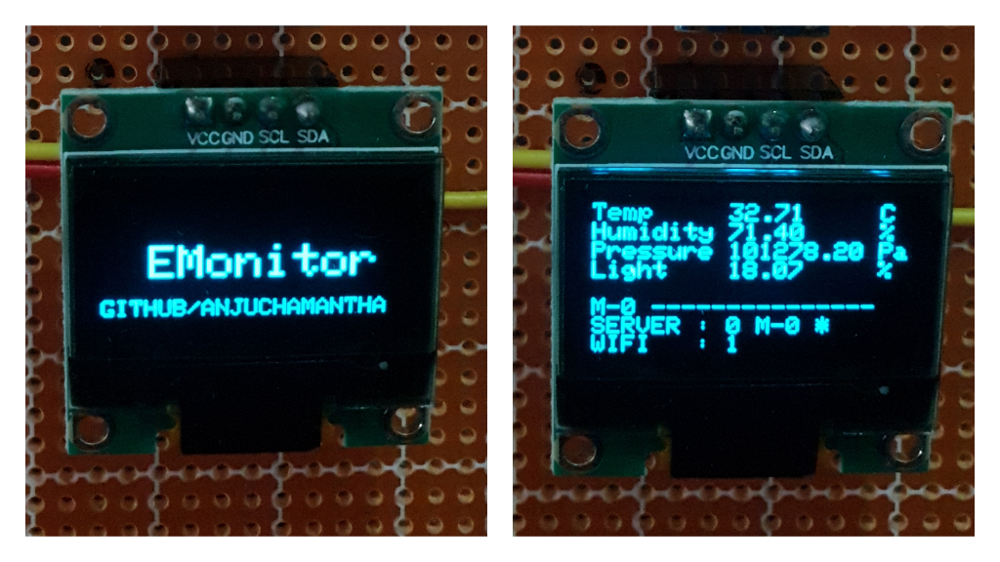

# EMonitor - Environment Monitoring Device

*by Anju Chamantha*

Website : [http://e-monitor.herokuapp.com](http://e-monitor.herokuapp.com/)

GitHub : [https://github.com/anjuchamantha/EMonitor](https://github.com/anjuchamantha/EMonitor)

## Table of Content

[TOC]

## 1) Introduction

EMonitor is a ESP32 Microcontroller based device which gets environmental data such as Temperature, Humidity, Pressure, Light Intensity, and sends those data to a Back-end database server using CAP(Common Alert Protocol). Also those data and other connection status information can be viewed from the OLED-display locally. The data that were sent to the server can be visualized using a simple [web-page](http://e-monitor.herokuapp.com/). The device also features self fault recovery mechanisms to add more reliability to the system. EMonitor also sends a warning e-mail to pre-defined e-mail addresses in case of any sensor data exceeding a given threshold value.

## 1) EMonitor Device : features & specifications

<Solidworks design>

*Prototype Device*


> *Scope of the Project*

EMonitor is a [ESP32](https://www.espressif.com/en/products/socs/esp32) microcontroller based device which has Wi-Fi inbuilt. With its Xtensa LX6 microprocessor operating at 240 MHz and memory of 520 KiB SRAM, EMonitor is more than capable of capturing the environment and sending data to the server after doing the necessary calculations seamlessly.  It runs on [FreeRTOS](https://www.iottechtrends.com/best-operating-systems-arduino/), a leading operating system supported by Arduino which can be working with the relevant peripherals smoothly.

### 1.1) Measuring Parameters

- Temperature (°C) 	- DHT11 Sensor module
- Humidity (%) 			- DHT11 Sensor module
- Pressure (Pa) 			- BMP180 Sensor module
- Light Level (%) 		  - LDR module

### 1.2) Power

The device can be powered using a Micro USB cable which is a very reliable mode of powering the ESP32 microcontroller. Since pretty much every standard mobile phone charging adapter outputs 5V, this device can be powered using the same way which means there's nothing to worry about power. Also EMonitor can be powered using any mobile phone charging power-bank which makes the device portable. 

The ESP32 is a low power consuming microcontroller and has adaptive power controlling mechanisms which can handle some basic power related matters that makes the EMonitor very reliable when powering with Micro USB cable.

### 1.3) Communication Protocol

Data is transmitted from the EMonitor device to the cloud hosted [EMonitor server](http://e-monitor.herokuapp.com/) using [CAP](http://docs.oasis-open.org/emergency/cap/v1.2/CAP-v1.2-os.html) (Common Alerting Protocol) over internet. CAP is an XML based data format for exchanging public warnings and emergencies between alerting technologies. 

### 1.4) Sensor Readings & Data sending to server

The sensor data (temperature, humidity, pressure, light level) are read at **T** time intervals and after **N** number of sensor readings the Mean & Standard Deviation of those N number of data are sent to the server using CAP protocol. So the data is sent to the server at **TN** time intervals. (There can be an average 2-3s delay other than TN due to the other logics and calculations)

*Example : Take N=15 & T=60s => The sensor readings are taken every 1 minute and after 15 rounds/readings (after 1min x 15 = 15 minutes) the mean and standard deviation of those 15 samples are send to the server.*

Following are the basic data sent to the server as a message which is referred as `MSG` hereafter.

`msg_id, timestamp, temperature, humidity, pressure, light, temperature_sd, humidity_sd, pressure_sd, light_sd`

Other than these data, some constant data that are mandatory for CAP, like `sender`,`msg type`, `category`, `urgency` etc are sent to the server.

### 1.5)Connection Lost Self-Recovery

The EMonitor device is capable of withstand the following connection lost scenarios,

- Wi-Fi connection Lost 
- Lost of connection to the EMonitor server

The device can self re-connect to Wi-Fi or self re-connect to server after any of the above cases. But the data is secure even during such connection issues.

In both above cases EMonitor detects the connection issue and cash the raw data which were not able to send to the server due to connection lost, to a buffer. After each TN time interval, the device checks the connection and if the connection is stable, it sends all the data which were buffered to the server and clears the buffer. (During this process also if the connection is lost, it keeps the data safely in the buffer without removing)


## 2) Website, Server & Database : features & specifications

**Deployed EMonitor website** : **[http://e-monitor.herokuapp.com/](http://e-monitor.herokuapp.com/)**




The backend server is developed using [Flask](https://flask.palletsprojects.com/en/1.1.x/) which is a Python based web framework. It supports all the existing python libraries and tools and hence it is very much scalable and extensible. 

The database used is [PostgreSQL](https://www.postgresql.org/) and all the data that comes to the server from the EMonitor device are saved in a database table of values, `msg_id, timestamp, temperature, humidity, pressure, light, temperature_sd, humidity_sd, pressure_sd, light_sd`

Backend supports the following end-points to communicate with it.

- [POST] : /data 
- [GET] : /

The EMonitor device uses `/data` end-point to send data to the server using CAP protocol. 

`/` endpoint is used to access the main dashboard of the EMonitor website, which shows the current(last received) readings as well as charts and the data of last 20 readings received.


## 3) Special features

### 3.1) OLED Display to view Readings and Connection States



OLED Display shows the temperature, humidity, pressure and light level values which are sent to the server with the `msg_id` after each TN time interval. Also it shows the Wi-Fi and Server connection statuses.(0 - Not connected, 1 - Connected)

 It also shows if a `MSG` is not sent to the server and buffered (using a `*` symbol) and sending buffered `MSG`s to the server (using \<B> symbol)

### 3.2) Automatic warning Email sending through EMonitor Device


The EMonitor device sends a WARNING e-mail to a pre defined  e-mail address if a value of a `MSG` exceeds a given threshold limit. 

*Currently if the temperature mean exceeds 40°C it sends a warning e-mail to my personal email.*


## 4) Design Architecture Diagram


## 5) Schematic diagram of EMonitor Device

*Breadboard Circuit Schematic*


*PCB Design*


## 6) Fault Recovery Implementation

As mentioned in *1.5) Connection Lost Self-Recovery*, EMonitor is capable of self connecting to Wi-Fi & Server after a connection lost. During the connection lost period, the MSGs are buffered and when the connection is established back, it sends the buffered MSGs to the server.

### 6.1) Auto connect to Wi-Fi

```cpp
void loop{
	//calculate readings and create CAP MSG
    if (WiFi.status() != WL_CONNECTED)
    {
        //if not connected, try to connect to WiFi in each loop iteration
        bool connected = connect_to_wifi();
        if (connected){
            //send MSG to server
        }
        else{
            //buffer MSG
        }
    }
    else{
        //send MSG to server
    }
}

bool connect_to_wifi(){
    WiFi.begin(SSID,PW) //begin the wifi connection
    if (WiFi.status() == WL_CONNECTED)
    {
        return truue;
    }
    else{
        return false;
    }
}
```


### 6.2) MSG Buffering

There are total of 11 buffers as follows

```cpp
queue<String> buffer_identifier;
queue<String> buffer_datetime;
queue<int> buffer_msg_ids;

//mean buffers
queue<double> buffer_t;
queue<double> buffer_h;
queue<double> buffer_p;
queue<double> buffer_l;

//sd buffers
queue<double> buffer_t_;
queue<double> buffer_h_;
queue<double> buffer_p_;
queue<double> buffer_l_;
```


```cpp
void loop{
  //BUFFER LOGIC

  //loop buffer if buffer is not empty
  //	if connected
  //		POST buffer data and pop from buffer
  //	else break
    while (!buffer_msg_ids.empty()){
        if (WiFi.status() == WL_CONNECTED){
            //create CAP MSG from raw data in buffers
            if (sendPostRequest(xmlchar_buf, msg_id_buf)){
                popBuffers();
            }
        }
    }
    
    //MAIN LOGIC
    
	//calculate readings and create CAP MSG
    if (WiFi.status() != WL_CONNECTED)
    {
        bool connected = connect_to_wifi();
        if (connected){
            //send MSG to server
            if (!sendPostRequest(xmlchar, msg)){
                //buffer MSG
                pushToBuffers();
            }
        }
        else{
            //buffer MSG
            pushToBuffers();
        }
    }
    else{
        //send MSG to server
        if (!sendPostRequest(xmlchar, msg)){
            //buffer MSG
            pushToBuffers();
        }
    }
}

void pushToBuffers(){
    //push all the raw data needed for MSG to queues
}

void popBuffers(){
    //pop the front element from the queues
}


```


## 7) List of components and their cost 

- NodeMCU ESP-32S Microcontroller (LKR 1,050.00)
- BMP180 Digital Barometric Pressure Sensor (LKR 185.00)
- DHT11 Temperature & Relative Humidity Sensor (LKR 250.00)
- LDR (LKR 10)
- OLED Display 0.96" (LKR 600.00)
- Resistor 220Ohm (LKR 1.00)
- Capacitor 10 micro F (LKR 20) - Used to back out the code uploading issue to ESP32
- Vero Board & Circuit Wires (LKR 150)


## 8) Algorithm used for device and server (Pseudo code)

### 8.1) EMonitor Device Algorithm

*main.cpp*

```cpp
void beginOLED(){
    //initial setup and starting of OLED Display
}
void displayText(){
    //display the content in the OLED display
    //in various places, this function is called to print sensor and other information
}
void getTimeStamp(){
    //get the current time
}
void popBuffers(){
    //pop the front element from the queues
}
void pushToBuffers(){
    //push all the raw data needed for MSG to queues
}

void setup(){
    beginOLED();
    wait_and_connect_to_wifi();
  	begin_sensors();
    configTime();
}

void loop(){
    
  //BUFFER LOGIC

  //loop buffer if buffer is not empty
  //	if connected
  //		POST buffer data and pop from buffer
  //	else break
    while (!buffer_msg_ids.empty()){
        if (WiFi.status() == WL_CONNECTED){
            //generate CAP XML message from the data in buffers
            generateXMLStr();
            if (sendPostRequest(xmlchar_buf, msg_id_buf)){
                popBuffers();
            }
        }
    }
    
    //MAIN LOGIC
    
	//calculate readings and create CAP MSG
    int x = 0;
    int rounds = 15;
  	int round_time = 2000;
    while (x < rounds){
        readTemperature();
        readHumidity();
        readPressure();
        readLightIntensity();
            
        delay(round_time);
        x++;
    }
    temperature = calculate_mean(t_, rounds);
  	humidity = calculate_mean(h_, rounds);
  	pressure = calculate_mean(p_, rounds);
  	light = calculate_mean(l_, rounds);
    
    temperature_sd = calculate_sd(t_, rounds, temperature);
  	humidity_sd = calculate_sd(h_, rounds, humidity);
  	pressure_sd = calculate_sd(p_, rounds, pressure);
  	light_sd = calculate_sd(l_, rounds, light);
    
    getTimeStamp(datetime_);
    
    //send WARNING e-mail
    if ((temperature > 40) && (WiFi.status() == WL_CONNECTED)){
        //if a warning e-mail has not sent in last 5minutes
        //	send mail
    }
    
    //generate CAP XML message from the calculated data
    generateXMLStr();
    
    if (WiFi.status() != WL_CONNECTED)
    {
        bool connected = connect_to_wifi();
        if (connected){
            //send MSG to server
            if (!sendPostRequest(xmlchar, msg)){
                //buffer MSG
                pushToBuffers();
            }
        }
        else{
            //buffer MSG
            pushToBuffers();
        }
    }
    else{
        //send MSG to server
        if (!sendPostRequest(xmlchar, msg)){
            //buffer MSG
            pushToBuffers();
        }
    }
}

```


### 8.2) Backend Server Logic

```python
#database table model
class EMonitor(db.Model):
    __tablename__ = 'sensor_data'
    id = db.Column(db.Integer, primary_key=True)
    msg_id = db.Column(db.String(128))
    timestamp = db.Column(db.String(128))

    temperature = db.Column(db.Float)
    humidity = db.Column(db.Float)
    pressure = db.Column(db.Float)
    light = db.Column(db.Float)

    temperature_sd = db.Column(db.Float)
    humidity_sd = db.Column(db.Float)
    pressure_sd = db.Column(db.Float)
    light_sd = db.Column(db.Float)
    
    
def extract_data_from_xml(xml_str):
    """
    Given a XML string(CAP) this extracts the 'parameter' values
    :param xml_str: XML as a string
    :return: data as dictionary {name:value}
    """
  
def put_to_db(xml_data):
    """
    given a data dictionary this method put the data to the database
    :param xml_data: data as dictionary {name:value}
    :return: True if database write successful, otherwise False
    """
    
@app.route('/data', methods=['POST'])
def post():
    xml_str = request.data
    xml_data = extract_data_from_xml(xml_str)
    print("[POST] /data : ", xml_data)
    if put_to_db(xml_data):
        return "DATABASE updated"
    else:
        return "DATABASE modification failed !"
 
@app.route('/')
def index():
    #query the database table and get the list of data
    table = EMonitor.query.order_by(desc(EMonitor.timestamp)).limit(20).all()

    return render_template("index.html", table)

```


## 9) Full source code (an Annexure)